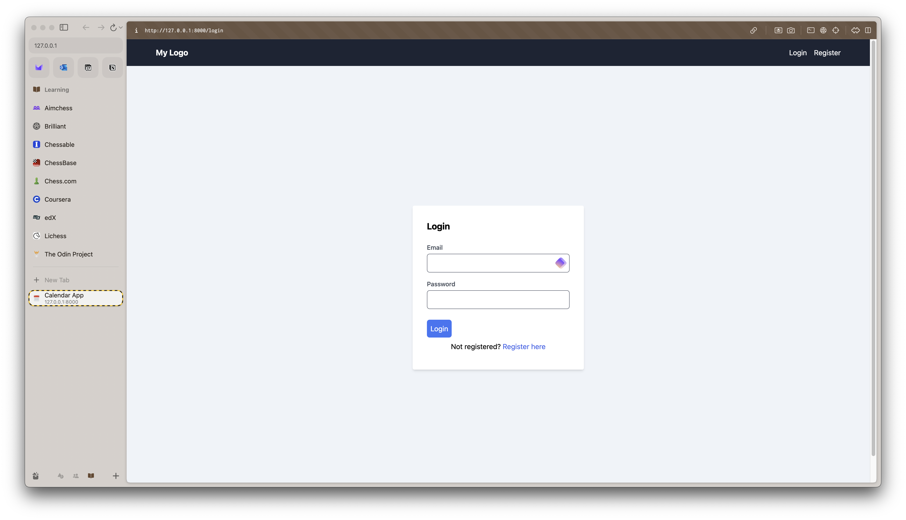
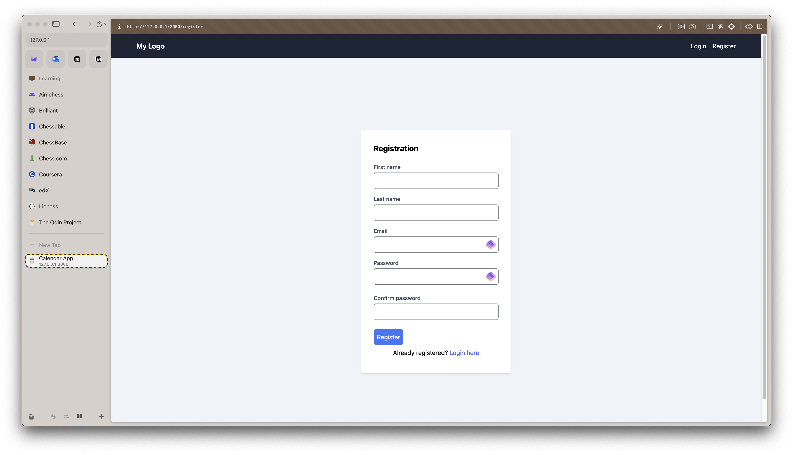
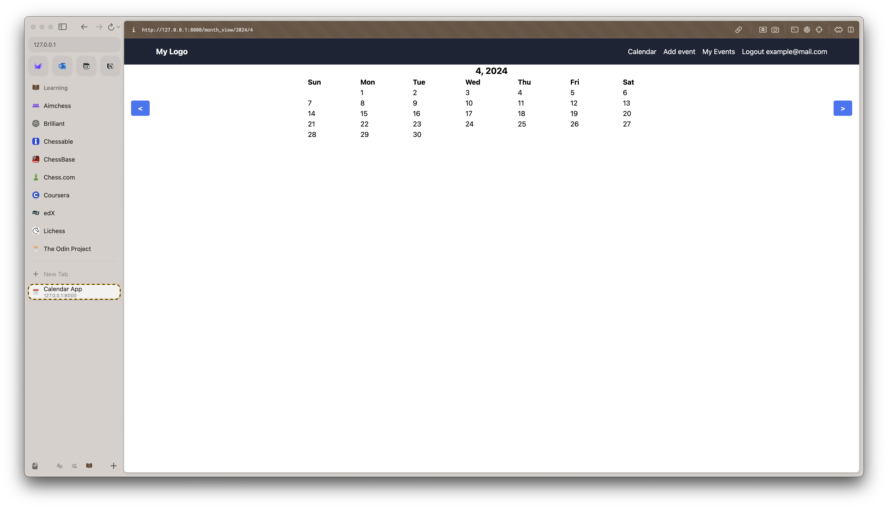
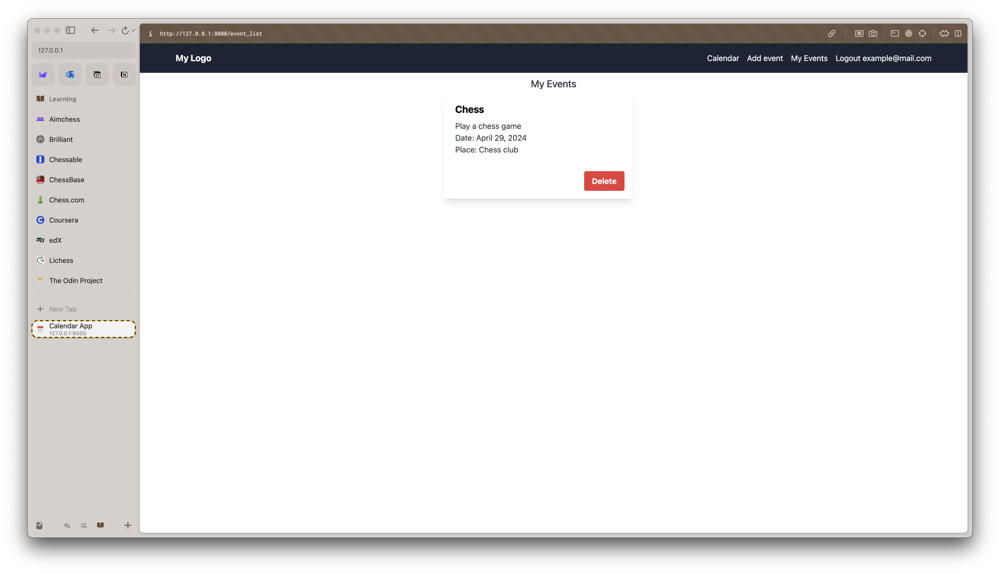

# CS50 Web Final Project: Calendar

## Introduction

This is the solution to the final task of CS50 Web course. It is a calendar app.

## Distinctiveness and complexity

There was no requirement to write a calendar app nor anything similar for the course, so this project is new. It includes quite a lot of complex functionality, such as registering, logging in and out, viewing current or some other month, adding and deleting events, viewing all events and events for an arbitrary day.

## Installation instructions

The prerequisites for running it are Python 3.12, Pip 24.0, Node 22.0, NPM 10.5, and SQLite 3.43. Clone the repository locally. In the project directory, create a virtual Python environment: `python -m venv venv`. Activate it: `source venv/bin/activate`. Install Python packages with `pip install -r requirements.txt`. Then install Node packages with `npm install`. Depending on your system, you might need to use python3 and pip3 instead. Then you have to create the database with `python manage.py makemigrations` and `python manage.py migrate`.

## Usage

Upon loading the application, the user is presented with a login screen.

If this is his first time, he has to register providing his first and last names, email, and password.

Then he is redirected to the main screen, where he can see the calendar of the current month. He can move to other months by pressing blue navigation buttons.

He can view all of his events by pressing My Events button in the navigation bar. By pressing Delete button, he can delete an event.

He can insert an event by pressing Add Event button in the navigation bar.

If there is an event on a given day, this day is colored blue in the calendar view. By pressing on a day in calendar view, the user is redirected to that day's events view.

## Code description

The project is created using the Django framework. Frontend is written in HTML and JavaScript. For styling, TailwindCSS is used. To make Django and Tailwind work, we use django-tailwind Python package and tailwindcss NPM package. The project consists of the default cs50web_final app, the calendarapp app where most of the code resides, and the theme app used for TailwindCSS purposes.

In the calendarapp/urls.py file, the URL endpoints are given. The view functions are given in the calendarapp/views.py file. There are three models described in calendarapp/models.py: CustomUserModel helper, User model, and Event model. The templates use Django templating language. The base template is layout.html. There are templatees for registering and logging in. There are templates for listing all events (event_list.html) and events for a given day (day_list.html). The calendar view comes from month_view.html template. Adding a new event resides with event.html template. Adding an event and displaying the calendar requires advanced front end functionality, which is given in event.js and month_view.js, respectively. In addition, there is a calendar favicon.
